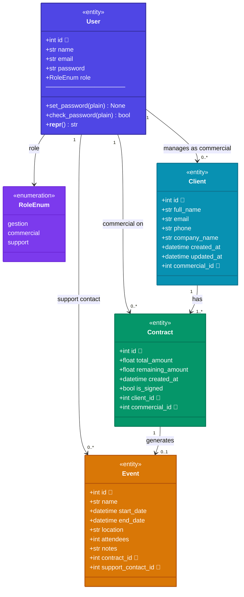
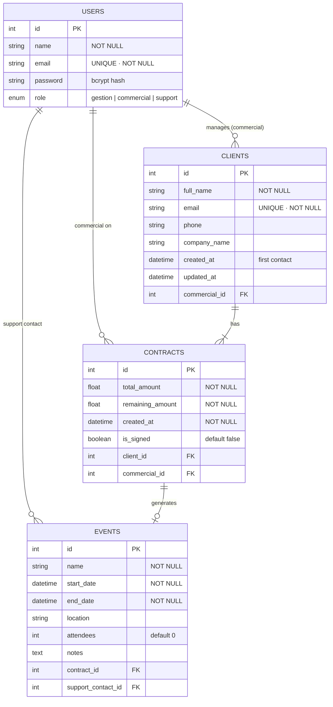

# Epic Events CRM — Diagrams

---

## 1. UML Class Diagram

```mermaid
classDiagram
    direction TB

    class RoleEnum {
        <<enumeration>>
        gestion
        commercial
        support
    }

    class User {
        <<entity>>
        +int id 🔑
        +str name
        +str email
        +str password
        +RoleEnum role
        ──────────────────
        +set_password(plain) None
        +check_password(plain) bool
        +__repr__() str
    }

    class Client {
        <<entity>>
        +int id 🔑
        +str full_name
        +str email
        +str phone
        +str company_name
        +datetime created_at
        +datetime updated_at
        +int commercial_id 🔗
    }

    class Contract {
        <<entity>>
        +int id 🔑
        +float total_amount
        +float remaining_amount
        +datetime created_at
        +bool is_signed
        +int client_id 🔗
        +int commercial_id 🔗
    }

    class Event {
        <<entity>>
        +int id 🔑
        +str name
        +datetime start_date
        +datetime end_date
        +str location
        +int attendees
        +str notes
        +int contract_id 🔗
        +int support_contact_id 🔗
    }

    %% Enum usage
    User --> RoleEnum : role

    %% User → Client  (commercial manages clients)
    User "1" --> "0..*" Client : manages as commercial

    %% User → Contract  (commercial linked to contracts)
    User "1" --> "0..*" Contract : commercial on

    %% User → Event  (support responsible)
    User "1" --> "0..*" Event : support contact

    %% Client → Contract
    Client "1" --> "1..*" Contract : has

    %% Contract → Event  (one-to-one)
    Contract "1" --> "0..1" Event : generates

    %% Style
    style User     fill:#4f46e5,color:#fff,stroke:#3730a3,stroke-width:2px
    style Client   fill:#0891b2,color:#fff,stroke:#0e7490,stroke-width:2px
    style Contract fill:#059669,color:#fff,stroke:#047857,stroke-width:2px
    style Event    fill:#d97706,color:#fff,stroke:#b45309,stroke-width:2px
    style RoleEnum fill:#7c3aed,color:#fff,stroke:#6d28d9,stroke-width:2px
```

---

## 2. Entity Relationship Diagram (ERD)

```mermaid
erDiagram

    USERS {
        int     id               PK
        string  name             "NOT NULL"
        string  email            "UNIQUE · NOT NULL"
        string  password         "bcrypt hash"
        enum    role             "gestion | commercial | support"
    }

    CLIENTS {
        int      id              PK
        string   full_name       "NOT NULL"
        string   email           "UNIQUE · NOT NULL"
        string   phone
        string   company_name
        datetime created_at      "first contact"
        datetime updated_at
        int      commercial_id   FK
    }

    CONTRACTS {
        int      id              PK
        float    total_amount    "NOT NULL"
        float    remaining_amount "NOT NULL"
        datetime created_at     "NOT NULL"
        boolean  is_signed       "default false"
        int      client_id       FK
        int      commercial_id   FK
    }

    EVENTS {
        int      id              PK
        string   name            "NOT NULL"
        datetime start_date      "NOT NULL"
        datetime end_date        "NOT NULL"
        string   location
        int      attendees       "default 0"
        text     notes
        int      contract_id     FK
        int      support_contact_id FK
    }

    %% ── Relationships ──────────────────────────────────────
    USERS    ||--o{ CLIENTS   : "manages (commercial)"
    USERS    ||--o{ CONTRACTS : "commercial on"
    USERS    ||--o{ EVENTS    : "support contact"
    CLIENTS  ||--|{ CONTRACTS : "has"
    CONTRACTS ||--o| EVENTS   : "generates"
```
